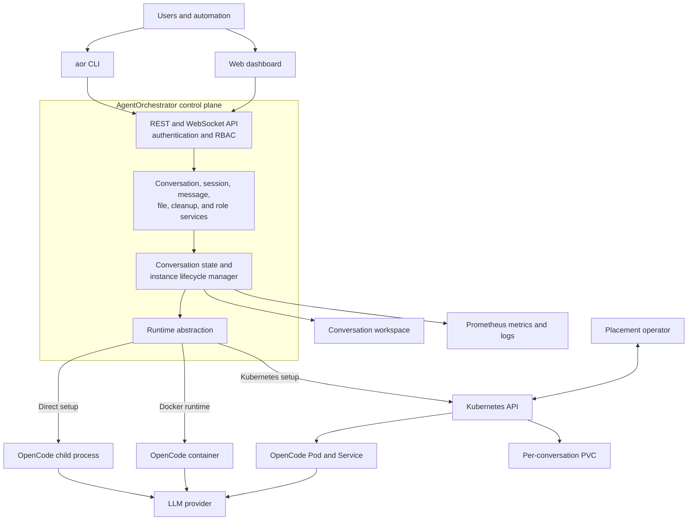

# AgentOrchestrator

A Node.js orchestrator that manages [OpenCode](https://opencode.ai) AI coding agent instances and exposes REST + WebSocket APIs for external integrations.

## Features

- **Process-level isolation** — Each conversation gets its own OpenCode instance
- **Dynamic port allocation** — Instances auto-assign ports from a configurable range
- **LRU eviction** — Automatically reclaims idle instances when at capacity
- **WebSocket real-time** — JSON-RPC 2.0 with event streaming
- **Role-based access control** — Admin, user, observer, and custom roles via API keys
- **Prometheus metrics** — 26 bounded custom metrics plus Node.js process metrics
- **Multi-runtime** — Direct process, Docker container, or Kubernetes Pod execution
- **Built-in dashboard** — Web UI for managing conversations
- **Operational CLI** — Manage conversations, sessions, cleanup, runtimes, and Kubernetes installs
- **Retention controls** — Rotating JSONL logs and ownership-safe persistent-data cleanup

## Choose a Setup

Each guide starts from prerequisites and finishes with a verified conversation,
session-persistence check, cleanup, and troubleshooting steps.

| Setup | Best for | End-to-end tutorial |
|-------|----------|---------------------|
| **Direct host process** | Development and a single trusted host; AgentOrchestrator spawns the local `opencode` binary | [Direct setup](docs/user/setup/direct.md) |
| **Docker container** | A self-contained single-host deployment with durable named volumes | [Docker setup](docs/user/setup/docker.md) |
| **Kubernetes** | Cluster scheduling, per-conversation PVCs, status CRDs, and optional placement automation | [Kubernetes setup](docs/user/setup/kubernetes.md) |

## Architecture



AgentOrchestrator owns the control-plane lifecycle. OpenCode performs the agent
work, while the selected runtime decides whether each instance is a host process,
Docker container, or Kubernetes Pod. See the [architecture overview](docs/architecture/README.md)
for the module and event flows.

## Quick Start

After completing one setup tutorial, use its API-key file and server URL:

```bash
aor --server http://127.0.0.1:8080 --api-key-file ./ao-admin.key status
aor --server http://127.0.0.1:8080 --api-key-file ./ao-admin.key conversation create readme-smoke --start
aor --server http://127.0.0.1:8080 --api-key-file ./ao-admin.key conversation get readme-smoke
aor --server http://127.0.0.1:8080 --api-key-file ./ao-admin.key session create readme-smoke --title "First session"
aor --server http://127.0.0.1:8080 --api-key-file ./ao-admin.key conversation delete readme-smoke --confirm
aor dashboard --server http://127.0.0.1:8080
```

After `create --start`, repeat `conversation get` until `ready` is `true`
before creating sessions or sending messages. Runtime health and OpenCode
session readiness are intentionally reported separately.

The `aor` CLI also manages conversation/session lifecycle, cleanup, status, and
AgentOrchestrator-owned Kubernetes components. See the [CLI command reference](docs/user/cli.md).

## Documentation

| Path | Description |
|------|-------------|
| [Architecture](docs/architecture/) | System design, data flows, security model |
| [Setup Tutorials](docs/user/setup/) | Direct, Docker, and Kubernetes end-to-end setup |
| [User Guide](docs/user/) | Installation, configuration, API reference, operations |
| [Developer Guide](docs/developer/) | Contributing, testing, coding standards, deep dives |
| [Full Docs Hub](docs/README.md) | Complete documentation index |

## Tech Stack

- **Runtime:** Node.js >= 24.0.0
- **Language:** TypeScript 6.x (strict mode)
- **Framework:** Express 5.x
- **WebSocket:** ws 8.x
- **Testing:** Vitest 5.x
- **Linting:** ESLint 10.x

## License

MIT License
