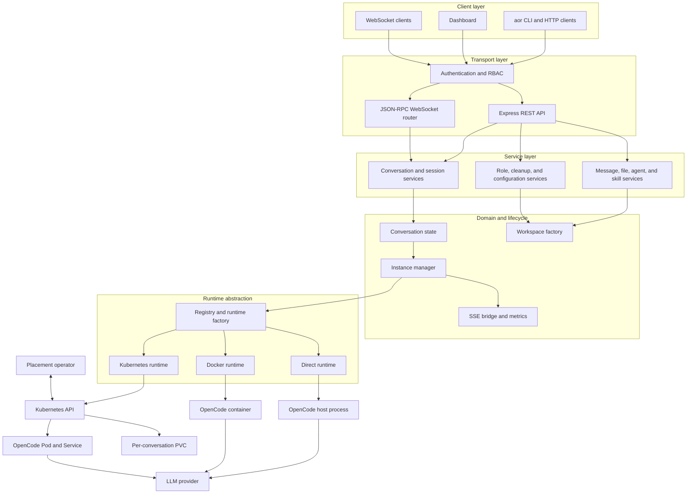

# Architecture Overview

AgentOrchestrator manages OpenCode AI coding agent instances and exposes REST
and WebSocket APIs for external integrations. The runtime abstraction keeps the
API and lifecycle model consistent while changing where OpenCode executes.

## System Layers

## Core Principles

1. **Layered separation** — Each layer has a focused responsibility; upper
   layers use lower layers through defined interfaces.
2. **Runtime abstraction** — A common runtime interface supports a direct host
   process, Docker container, or Kubernetes Pod per active conversation.
3. **Event-driven state** — `ConversationState` is the lifecycle source of
   truth. State changes emit events to WebSocket clients and metrics.
4. **Config-driven operation** — Ports, limits, authentication, storage,
   cleanup, logging, and runtime behavior come from one validated JSONC config.
5. **Graceful lifecycle** — Start, stop, restart, migrate, idle eviction, and
   delete have explicit transitions and preserve or remove data intentionally.
6. **Ownership-safe cleanup** — Managed persistent artifacts carry installation
   ownership and generation metadata; foreign artifacts are report-only.

## Deployment Shapes

| Shape | AgentOrchestrator | OpenCode | Persistent state |
|-------|-------------------|----------|------------------|
| [Direct](../user/setup/direct.md) | Host Node.js process | Host child process | Local workspace and managed session directories |
| [Docker](../user/setup/docker.md) | Container | Bundled child process, or optional Docker runtime | Named volumes |
| [Kubernetes](../user/setup/kubernetes.md) | Deployment | Per-conversation Pod and Service | Workspace PVC plus per-conversation PVCs |

## Key Documents

| Document | Description |
|----------|-------------|
| [Data Flows](data-flows.md) | Step-by-step request/response sequences |
| [Security](security.md) | Authentication, authorization, and RBAC model |
| [Modules Reference](modules.md) | Core modules and method tables |
| [Setup Tutorials](../user/setup/) | Direct, Docker, and Kubernetes end-to-end procedures |
| [API Reference](../user/api/) | REST, WebSocket, and SSE API documentation |
| [Configuration](../user/configuration/) | Configuration fields and overrides |
| [Deployment](../user/deployment/) | Production operations references |
