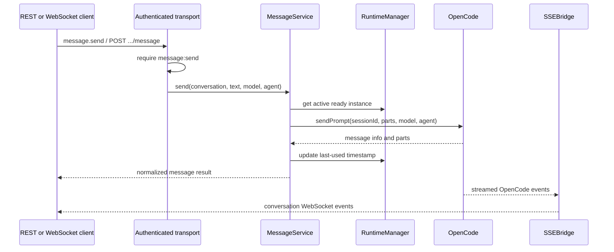
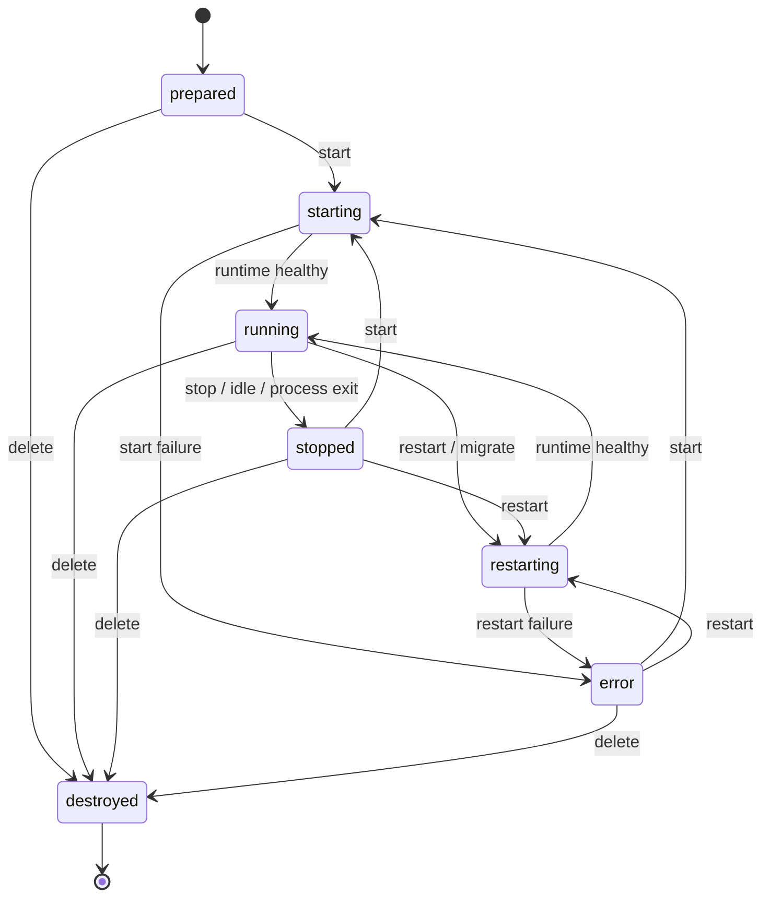
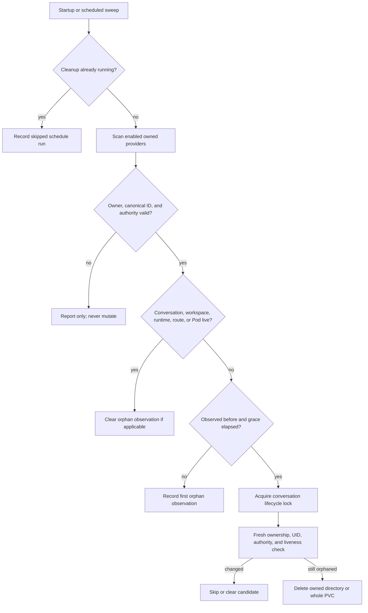

# Data Flows

These flows describe current behavior across REST and WebSocket transports. Both
transports call the same services, so lifecycle locking, storage policy, and
runtime behavior remain consistent.

## 1. Prepare and Start a Conversation

`POST /api/conversations` prepares durable workspace state only. Starting is a
separate operation unless the CLI was invoked with `conversation create --start`.

```mermaid
sequenceDiagram
    participant C as Client / aor
    participant H as HTTP route
    participant S as ConversationService
    participant W as WorkspaceFactory
    participant I as InstanceManager
    participant R as RuntimeManager
    participant A as Runtime adapter
    participant O as OpenCode

    C->>H: POST /api/conversations {id, agentType}
    H->>S: create(id, agentType)
    S->>S: acquire per-conversation lifecycle lock
    S->>W: create(id, agentType)
    S-->>C: 201 prepared

    C->>H: POST /api/conversations/:id/start
    H->>S: start(id)
    S->>S: prepared/stopped/error → starting
    S->>I: createInstance(id, agentType)
    I->>I: reserve capacity; evict LRU if required
    I->>W: ensure existing workspace
    I->>R: start(id, workspace, auth, health config)
    R->>A: start(...)
    A->>O: spawn process/container/Pod
    A->>O: authenticated health polling
    O-->>A: healthy
    A-->>R: AgentEndpoint
    R-->>S: active InstanceInfo
    S->>S: starting → running; start readiness and SSE
    S-->>C: 200 running, ready=false
```

`running` means the runtime passed its health check. `ready` becomes true after
AO has a usable OpenCode session; clients that need session/message operations
should wait for it.

## 2. Send a Message



Quota and rate-limit errors are normalized, counted, and optionally reported to
the Kubernetes status resource for placement decisions.

## 3. Stop, Restart, and Idle Eviction

Stop and idle eviction terminate only the active runtime. They preserve the
conversation record, workspace, and managed session data.



Restart reuses the workspace and attempts to resume the previous session ID.
Kubernetes migration recreates the runtime on the target node against the same
conversation PVC and reports whether session resumption succeeded.

## 4. Explicit Conversation Deletion

Explicit deletion is the only normal lifecycle operation that owns immediate
workspace and managed-session removal.

```mermaid
sequenceDiagram
    participant C as Client
    participant S as ConversationService
    participant R as Runtime adapter
    participant P as Managed persistent data
    participant W as Workspace storage
    participant K as Cluster reporter

    C->>S: DELETE /api/conversations/:id
    S->>S: acquire lifecycle lock
    S->>R: preparePersistentDataDeletion(id)
    R->>P: persist delete-pending generation
    S->>R: stop runtime and observe exit
    S->>R: deletePersistentData(id)
    R->>P: quarantine matching generation, then purge
    S->>W: destroy workspace
    S->>K: remove instance/route status
    S->>S: transition destroyed; remove in-memory record
    S-->>C: 204 No Content
```

If deletion intent cannot be recorded or the runtime cannot be stopped, AO
returns `PERSISTENT_DATA_CLEANUP_PENDING`. Generation checks prevent a stale
retry from deleting newly recreated data with the same conversation ID.

## 5. Scheduled Orphan Cleanup



Preview uses the same discovery rules but never marks, clears, quarantines, or
deletes. Manual runs cannot override configured retention or grace periods.

## Failure Boundaries

- Runtime start failures transition the conversation to `error`; capacity and
  port cleanup remains the runtime manager's responsibility.
- Workspace writes charge only the replacement-size delta and fail before
  mutation when the quota would be exceeded.
- REST and WebSocket routes require an explicit permission when RBAC is enabled;
  unmapped authenticated operations fail closed.
- Cleanup provider failures are isolated into sanitized `partial` or `failed`
  reports so successful artifacts remain visible without exposing paths or data.
- Graceful shutdown stops scheduling, closes WebSockets, drains HTTP work,
  destroys active runtimes, stops cluster reporting, and flushes file logging
  within `server.shutdownTimeoutMs`.
