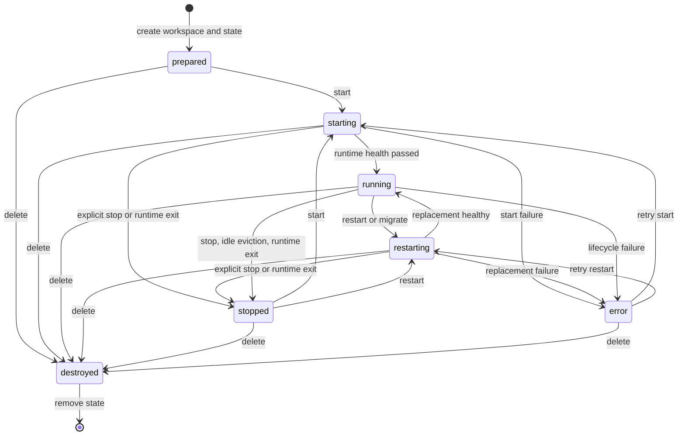

# Conversation Lifecycle

`ConversationState` is the in-process source of truth. `ConversationService`
serializes mutations per conversation ID so create/start/stop/restart/migrate,
explicit delete, and cleanup final checks cannot race one another.

## State Machine

The stored statuses are `prepared`, `starting`, `running`, `restarting`,
`stopped`, `destroyed`, and `error`. There are no stored `stopping` or
`destroying` states.

## State and Readiness

`running` and `ready` answer different questions:

- `running` means the selected runtime created an endpoint and passed its
  authenticated health check.
- `ready` means AO can access or create the conversation's OpenCode session.
- A readiness keepalive can emit `conversation.readyLost` without immediately
  discarding the runtime.

Session and message services reject requests until a running instance is ready.
Start and restart return before asynchronous session adoption completes, so
clients should poll `conversation get` or observe `conversation.ready`.

## Lifecycle Ownership

### Create

1. Validate the canonical conversation ID and configured runtime ID.
2. Acquire the per-conversation lifecycle lock.
3. Create the workspace through `WorkspaceFactory` and the storage backend.
4. Create `ConversationState` in `prepared` status.

Duplicate concurrent creation is serialized and returns a conflict without
overwriting the existing workspace.

### Start

1. Transition to `starting`.
2. Reserve instance capacity before the first asynchronous operation.
3. Reuse or create the workspace and obtain its `RuntimeAccess` descriptor.
4. Call `RuntimeManager.start()`, which delegates to `AgentRuntime.start()`.
5. Register generation-safe exit handling and transition to `running`.
6. Start readiness checks, SSE forwarding, and optional Kubernetes status
   reporting.

Runtime validation failures remain attached to their configured runtime ID and
are returned before workspace/runtime mutation.

### Stop and Idle Eviction

Stop disconnects SSE, waits for observed process/container/Pod termination,
releases active runtime state, and transitions to `stopped`. Idle eviction and
unexpected runtime exit converge on the same stopped state.

These operations preserve:

- the conversation record and event buffer;
- the workspace and OpenCode configuration;
- managed Direct/Docker session storage;
- the Kubernetes conversation PVC.

### Restart and Migration

Restart transitions through `restarting`, reuses persistent data, and tries to
adopt the previous session ID. If the runtime-specific restart fails, AO removes
the stale instance and starts a replacement.

Kubernetes migration temporarily applies a node override, recreates the runtime
against the same PVC, verifies session adoption, emits
`conversation.migrated`, reports the new endpoint/node, and clears the override
in a `finally` block.

### Explicit Delete

Delete first persists generation-specific delete intent, then stops the runtime,
quarantines and purges managed session data, destroys the workspace, removes
cluster status, emits `conversation.destroyed`, and removes the state record.

If intent cannot be recorded or termination is not observed, the operation
fails with `PERSISTENT_DATA_CLEANUP_PENDING`. A stale retry cannot delete a new
generation created later with the same conversation ID.

## Event Model

`ConversationState` retains at most 100 events per conversation in memory.
`GET /api/conversations/:id/events?limit=N` returns the newest bounded history,
and a new WebSocket connection receives the retained events before live fan-out.
Events are not persisted across an AO restart.

Core AO-generated events include:

| Event | Meaning |
|-------|---------|
| `conversation.prepared` | Workspace and state were created. |
| `conversation.starting`, `.running`, `.restarting`, `.stopped`, `.error`, `.destroyed` | Lifecycle transition. |
| `conversation.ready`, `.readyLost` | OpenCode session availability changed. |
| `conversation.needsRestart` | Configuration changed while a runtime was active. |
| `conversation.configChanged` | Config, agents, or skills changed. |
| `conversation.thinking`, `.message` | Message request/response lifecycle. |
| `conversation.quotaExhausted` | OpenCode reported a normalized quota error. |
| `conversation.migrated` | Kubernetes replacement completed on the target node. |

The SSE bridge also maps supported OpenCode events into the same conversation
event stream. Heartbeats can be filtered through configuration.

## Failure Guarantees

- Lifecycle locks are per conversation; unrelated conversations proceed in
  parallel.
- Instance start reserves capacity synchronously, preventing concurrent starts
  from exceeding `maxInstances`.
- Exit callbacks carry a generation number, so a replaced process cannot remove
  the new instance or release its port.
- Runtime termination must be observed before instance state and ports are
  released.
- Workspace removal failures retain conversation state in `error` so deletion
  can be retried instead of falsely reporting success.
- Stop/restart/migration/idle eviction never invoke persistent-data deletion.
