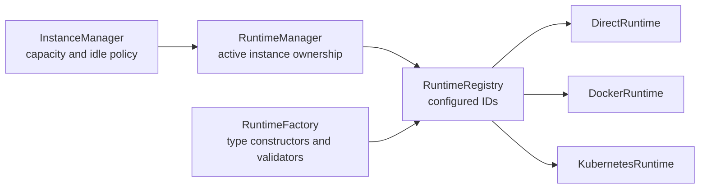

# Runtime Abstraction

Runtime IDs are user-facing configuration identities (for example,
`opencode-docker`). Runtime types select an implementation (`direct`, `docker`,
or `kubernetes`). Multiple IDs can use the same type with different settings.

## Layers



- `InstanceManager` reserves capacity, applies LRU/idle policy, and resolves the
  workspace.
- `RuntimeManager` owns active endpoints, handles, ports, activity timestamps,
  exit generations, and persistent-data hooks.
- `RuntimeRegistry` retains valid adapters and invalid configured entries so
  `/api/runtimes` can explain why one is unavailable.
- `RuntimeFactory` maps runtime types to constructors and validators during
  bootstrap.

## Contracts

```typescript
interface AgentRuntime {
  readonly type: string;
  readonly capabilities: AgentCapabilities;

  start(
    id: string,
    workspacePath: string,
    auth: { username: string; password: string },
    healthCheck: HealthCheckConfig,
    runtimeAccess?: RuntimeAccess,
  ): Promise<AgentEndpoint>;

  stop(handle?: InstanceHandle, signal?: string): Promise<void>;
  restart(id: string, healthCheck: HealthCheckConfig): Promise<AgentEndpoint>;
  cleanupOrphans?(): Promise<void>;
  preparePersistentDataDeletion?(id: string): Promise<void>;
  deletePersistentData?(id: string): Promise<void>;
}
```

`AgentEndpoint` contains the typed OpenCode client and optional process handle,
port, base URL, Kubernetes node name, and persistent-data ownership annotations.
`InstanceHandle` provides `kill()`, bounded `waitForExit()`, `onExit()`,
`hasExited()`, and exit metadata.

The optional persistent-data methods are invoked only for explicit conversation
deletion. Stop, restart, migration, idle eviction, and AO shutdown preserve
managed session data.

## Direct Runtime

`DirectRuntime` starts:

```text
opencode serve --port <allocated> --hostname 0.0.0.0
```

It sets per-instance server credentials, uses the workspace as `cwd`, optionally
maps managed `sessionStorage` through XDG/SQLite environment variables, and
terminates the process tree with `tree-kill`. A handle is not considered gone
until exit is observed or termination times out.

## Docker Runtime

`DockerRuntime` uses a deterministic container name
`agentorchestrator-<conversationId>`, mounts the workspace, maps the allocated
port unless host networking is selected, injects OpenCode server credentials,
and waits for authenticated health.

Supported runtime-specific controls include:

- `networkMode` and `instanceHost`;
- managed `sessionStorage` mounted at `/opencode-data`;
- Docker `local`/`json-file` log limits;
- `containerUser` plus a writable `containerHome` for Linux bind-mount
  ownership.

The runtime uses `docker rm -f` for stop and observes `docker wait` for exit.

## Kubernetes Runtime

`KubernetesRuntime` creates one PVC (when absent), Pod, and ClusterIP Service per
conversation. It:

- applies owner/artifact/state annotations;
- mounts the whole conversation PVC for workspace and session paths;
- optionally pins the Pod to a migration target node;
- waits for Pod Ready, then verifies OpenCode health;
- deletes Pods/Services with UID-aware safety and delegates retained-PVC policy
  to explicit deletion or the cleanup coordinator.

When AO runs outside the cluster, `instanceHost` can point at a matching
port-forward. Normal in-cluster operation uses Service DNS.

## Start and Exit Safety

1. `InstanceManager` adds the ID to `pendingStarts` before awaiting, so concurrent
   starts cannot overcommit `maxInstances`.
2. `RuntimeManager` calls the selected adapter and registers a monotonically
   increasing generation on the returned handle.
3. A stale exit callback from a replaced handle is ignored when its generation
   no longer matches.
4. Instance state and ports are released only after termination is observed.
5. The registered destroy callback transitions a still-active conversation to
   `stopped` without deleting its workspace or session data.

## Adding a Runtime Type

1. Implement `AgentRuntime` and its handle/client integration.
2. Add a typed config entry to `src/config-loader.ts`.
3. Register the constructor and validator in
   `src/bootstrap/runtime-environment.ts`.
4. Define persistent-data behavior explicitly. If the runtime cannot safely own
   deletion, omit the optional hooks.
5. Add unit coverage for arguments, health, failure cleanup, exit observation,
   restart, and generation safety.
6. Add an isolated E2E scenario and update configuration/runtime documentation.

Do not register concrete runtimes directly in `src/index.ts`; bootstrap owns
construction so server startup, config validation, and tests use one path.
