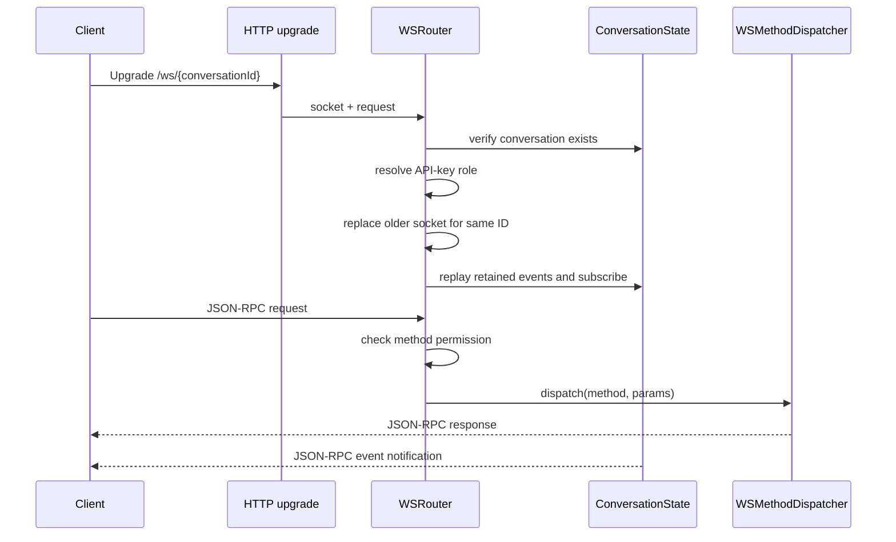

# WebSocket Protocol Internals

The WebSocket transport exposes conversation-scoped operations through JSON-RPC
2.0 while reusing the same application services and RBAC permissions as REST.

## Upgrade and connection lifecycle



`WSRouter` owns authentication, permission checks, connection replacement, event
subscriptions, and shutdown. `WSConnection` owns framing, responses, ping/pong,
idle timeout, and socket disposal. `WSMethodDispatcher` validates method-specific
parameters and calls the service layer.

## Authentication and authorization

The upgrade accepts an API key from `?apiKey=` or `x-api-key`. Authentication
behavior follows `server.rbac.enabled`:

- `true`: a configured key and its built-in or custom role are required.
- `false`: authorization is disabled and the connection uses administrative
  authority internally.
- omitted: RBAC is enabled when API keys are configured and disabled otherwise.

Each method maps to one permission in `WS_METHOD_PERMISSIONS`. The router asks
`RoleService` whether the resolved role grants that permission. Unknown methods
and insufficient permissions are rejected before dispatch. The public method and
permission table is maintained in the [WebSocket API](../../user/api/websocket.md).

## Framing

Request:

```json
{
  "jsonrpc": "2.0",
  "id": 1,
  "method": "session.get",
  "params": { "sessionId": "ses_123" }
}
```

Response:

```json
{
  "jsonrpc": "2.0",
  "id": 1,
  "result": { "id": "ses_123" }
}
```

Event notification:

```json
{
  "jsonrpc": "2.0",
  "method": "conversation.ready",
  "params": { "agentType": "opencode-direct" }
}
```

The transport emits `-32700` for invalid JSON and `-32600` for an invalid
JSON-RPC envelope. Errors raised while authorizing or dispatching a valid request
use `-32000`; an `AppError` also contributes its stable application code in
`error.data.code`. Requests without an `id` are treated as notifications and do
not receive success or error responses.

## Event replay and replacement

After establishing a connection, the router sends the conversation's retained
events in order and then subscribes to live events. Event types become JSON-RPC
`method` values and event payloads become `params`.

Only one active socket is stored for each conversation. A new connection sends
`connection.replaced` to the old socket, closes it, and removes the old event
subscription without allowing the old socket's close callback to unregister the
new socket. A `conversation.destroyed` event is delivered before the connection
closes after a short grace period.

## Liveness and shutdown

- The server sends ping frames every `websocket.heartbeatIntervalMs`.
- Pong or message activity resets the idle timer.
- More than two consecutive missed heartbeat cycles terminates the socket.
- Idle sockets close normally after `websocket.idleTimeoutMs`.
- Graceful server shutdown closes all sockets with code `1001` and removes all
  subscriptions.

Relevant implementation files:

- `src/websocket/router.ts`
- `src/websocket/connection.ts`
- `src/websocket/method-dispatcher.ts`
