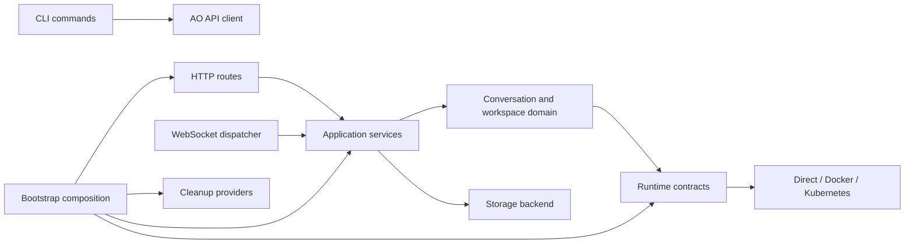

# Project Structure

The repository is organized around transport, application services, lifecycle,
runtime adapters, and infrastructure. Production functions are kept below the
project's configured 100-line limit; composition belongs in `bootstrap/` and
thin transport modules delegate to services.

```text
agent-orchestrator/
├── src/
│   ├── index.ts                       # Server/operator startup and shutdown
│   ├── cli.ts                         # Commander root and command registration
│   ├── config-loader.ts               # JSONC loading, env overrides, validation
│   ├── bootstrap/
│   │   ├── application-services.ts    # Storage/domain/service composition
│   │   ├── runtime-environment.ts     # Runtime factory, validation, registry
│   │   └── cleanup.ts                 # Cleanup-provider composition
│   ├── cli/
│   │   ├── api-client.ts              # Authenticated AO HTTP client
│   │   ├── operational.ts             # Status/conversation/session commands
│   │   ├── output.ts                  # Human and stable JSON output
│   │   ├── k8s-command.ts             # Kubernetes command registration
│   │   ├── k8s-renderer.ts            # Deterministic manifest transformation
│   │   └── k8s-manager.ts             # Apply, inspect, adopt, and uninstall
│   ├── http-api/
│   │   ├── server.ts                  # Thin Express/WebSocket composition root
│   │   ├── auth.ts                    # Authentication and route permissions
│   │   ├── middleware.ts              # Headers, CORS, metrics, error handling
│   │   ├── request-tracker.ts         # In-flight request draining
│   │   ├── websocket-server.ts        # Upgrade and socket lifecycle
│   │   ├── route-helpers.ts           # Shared response/error adapters
│   │   ├── openapi.ts                 # OpenAPI 3.0 document
│   │   ├── dashboard.ts               # Built-in SPA mounting
│   │   └── routes/                    # Resource-focused REST controllers
│   ├── websocket/
│   │   ├── connection.ts              # JSON-RPC framing and heartbeat
│   │   ├── router.ts                  # Connection ownership and RBAC
│   │   └── method-dispatcher.ts       # RPC-to-service dispatch
│   ├── services/                      # Application use cases
│   │   ├── conversation-service.ts
│   │   ├── session-service.ts
│   │   ├── message-service.ts
│   │   ├── config-service.ts
│   │   ├── agent-service.ts
│   │   ├── file-service.ts
│   │   ├── skill-service.ts
│   │   └── role-service.ts
│   ├── orchestrator/                  # Conversation/runtime lifecycle domain
│   ├── agent-runtime/
│   │   ├── types.ts                   # AgentRuntime and AgentClient contracts
│   │   ├── registry.ts                # Configured runtime identities
│   │   ├── runtime-factory.ts         # Adapter construction and validation
│   │   ├── runtime-manager.ts         # Active instance ownership
│   │   ├── session-storage.ts         # Durable ownership metadata/quarantine
│   │   └── runtimes/                  # Direct, Docker, Kubernetes adapters
│   ├── cleanup/                       # Coordinator and cleanup providers
│   ├── cluster/
│   │   ├── status-reporter.ts         # OpencodeInstance status/ownership
│   │   └── operator/                  # Placement controller and executor
│   ├── storage/                       # Backend contract and safe local storage
│   ├── opencode-http/                 # Typed HTTP/SSE OpenCode client
│   ├── metrics/registry.ts            # Prometheus metric registry
│   ├── utils/                         # Logging, errors, IDs, model parsing
│   └── test-fixtures/                 # Shared unit/E2E fixtures
├── dashboard/index.html               # Built-in dashboard
├── config/                            # Example AO/OpenCode configurations
├── k8s/
│   ├── crd/                           # OpencodeInstance/ConversationRoute CRDs
│   ├── orchestrator/                  # AO workload, RBAC, service, storage
│   ├── operator/                      # Placement operator workload and RBAC
│   └── volume/                        # Per-conversation templates
├── e2e/
│   ├── helpers/                       # Server, process, WebSocket, k8s helpers
│   ├── scenarios/                     # CLI, lifecycle, runtime, logging, k8s
│   ├── kubernetes/run-k3d.ts          # Isolated k3d lifecycle runner
│   └── vitest.config.*.ts             # Runtime-specific E2E configurations
├── scripts/                           # Hooks, cleanup, package verification
├── docs/                              # User, developer, and architecture docs
└── .github/                           # CI, release workflows, PR template
```

## Dependency Direction



- Transport code validates protocol input and translates errors; it does not
  implement lifecycle or storage policy.
- Services coordinate use cases and are shared by REST and WebSocket paths.
- Runtime adapters own process/container/Pod mechanics behind `AgentRuntime`.
- Storage and cleanup modules enforce path, ownership, generation, and retention
  safety without depending on HTTP or CLI presentation.
- Bootstrap modules are the only place where concrete implementations are wired
  together for the long-running server.

## File Naming

| Pattern | Purpose |
|---------|---------|
| `kebab-case.ts` | Production source |
| `*.test.ts` | Unit or integration tests colocated with source |
| `e2e/scenarios/**/*.test.ts` | End-to-end scenarios |
| `*.d.ts` | Ambient type declarations |

See [Modules Reference](../architecture/modules.md) for ownership details and
[Coding Standards](coding-standards.md) for cohesion and function-length rules.
